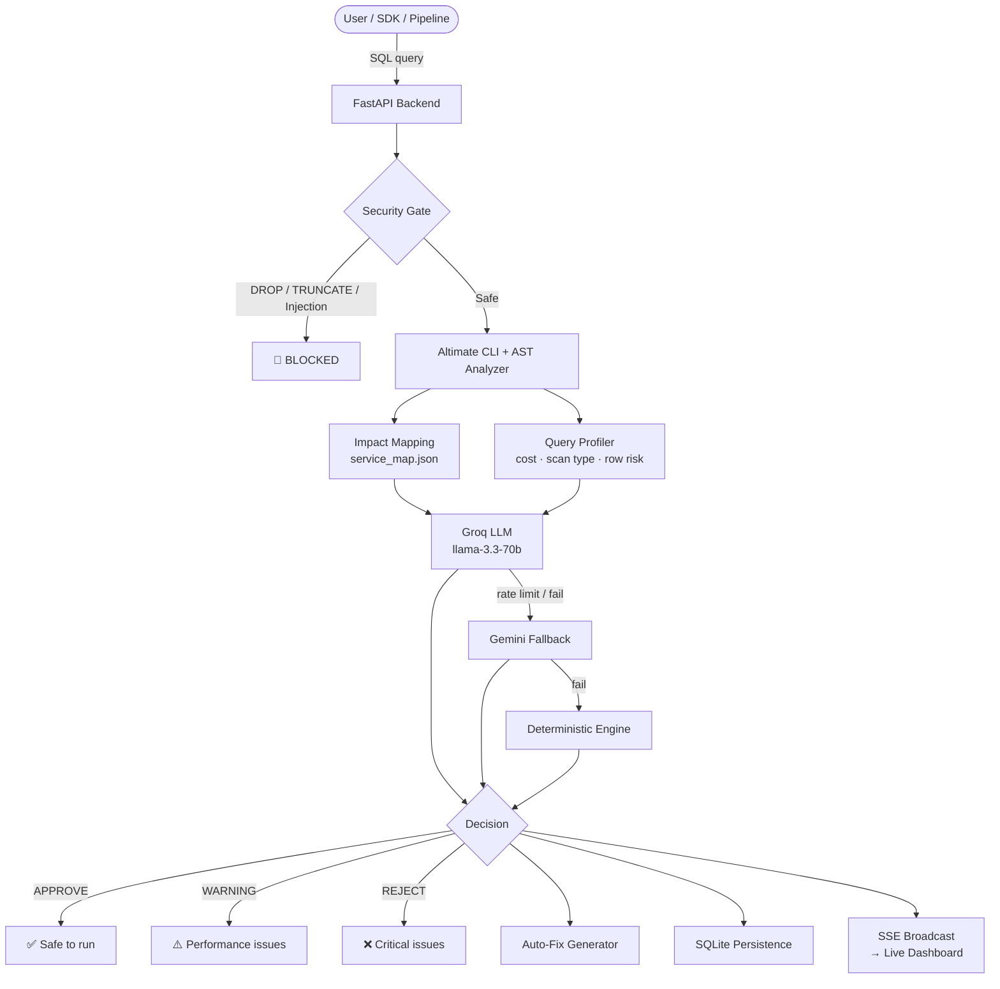
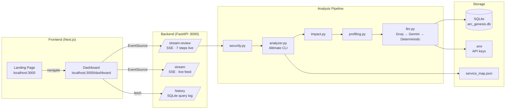
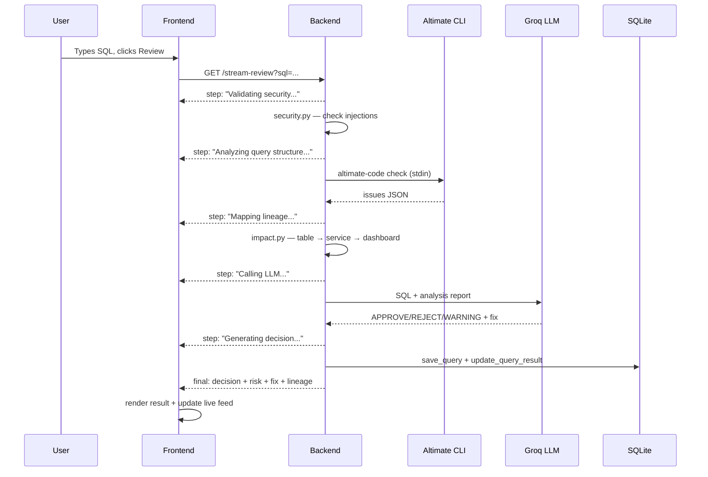

# Arc Genesis — Architecture

## System Flow

```mermaid
flowchart TD
    A([User / SDK / Pipeline]) -->|SQL query| B[FastAPI Backend]

    B --> C{Security Gate}
    C -->|DROP / TRUNCATE / Injection| D[🚫 BLOCKED]
    C -->|Safe| E[Altimate CLI + AST Analyzer]

    E --> F[Impact Mapping\nservice_map.json]
    E --> G[Query Profiler\ncost · scan type · row risk]

    F --> H[Groq LLM\nllama-3.3-70b]
    G --> H

    H -->|rate limit / fail| I[Gemini Fallback]
    I -->|fail| J[Deterministic Engine]

    H --> K{Decision}
    I --> K
    J --> K

    K -->|APPROVE| L[✅ Safe to run]
    K -->|WARNING| M[⚠️ Performance issues]
    K -->|REJECT| N[❌ Critical issues]

    K --> O[Auto-Fix Generator]
    K --> P[SQLite Persistence]
    K --> Q[SSE Broadcast\n→ Live Dashboard]
```

---

## Component Map

```mermaid
flowchart LR
    subgraph Frontend["Frontend (Next.js)"]
        LP[Landing Page\nlocalhost:3000]
        DB[Dashboard\nlocalhost:3000/dashboard]
    end

    subgraph Backend["Backend (FastAPI :8000)"]
        SR[/stream-review\nSSE · 7 steps live/]
        SF[/stream\nSSE · live feed/]
        HI[/history\nSQLite query log/]
    end

    subgraph Pipeline["Analysis Pipeline"]
        SEC[security.py]
        ANL[analyzer.py\nAltimate CLI]
        IMP[impact.py]
        PRF[profiling.py]
        LLM[llm.py\nGroq → Gemini → Deterministic]
    end

    subgraph Storage["Storage"]
        DB2[(SQLite\narc_genesis.db)]
        SM[service_map.json]
        ENV[.env\nAPI keys]
    end

    LP -->|navigate| DB
    DB -->|EventSource| SR
    DB -->|EventSource| SF
    DB -->|fetch| HI

    SR --> SEC --> ANL --> IMP --> PRF --> LLM
    ANL --> SM
    LLM --> DB2
    LLM --> ENV
```

---

## Query Lifecycle

```mermaid
sequenceDiagram
    participant U as User
    participant FE as Frontend
    participant BE as Backend
    participant AL as Altimate CLI
    participant AI as Groq LLM
    participant DB as SQLite

    U->>FE: Types SQL, clicks Review
    FE->>BE: GET /stream-review?sql=...
    BE-->>FE: step: "Validating security..."
    BE->>BE: security.py — check injections
    BE-->>FE: step: "Analyzing query structure..."
    BE->>AL: altimate-code check (stdin)
    AL-->>BE: issues JSON
    BE-->>FE: step: "Mapping lineage..."
    BE->>BE: impact.py — table → service → dashboard
    BE-->>FE: step: "Calling LLM..."
    BE->>AI: SQL + analysis report
    AI-->>BE: APPROVE/REJECT/WARNING + fix
    BE-->>FE: step: "Generating decision..."
    BE->>DB: save_query + update_query_result
    BE-->>FE: final: decision + risk + fix + lineage
    FE->>FE: render result + update live feed
```
