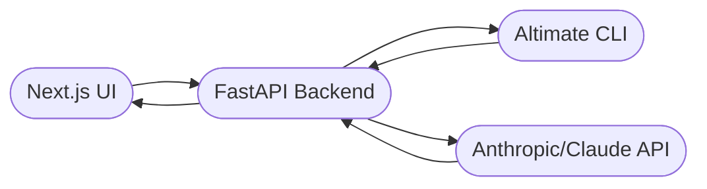

# Executive Summary  
Arc Genesis — an AI-based SQL review tool built atop Altimate Code — aligns well with Altimate’s hackathon goals. Using Altimate’s deterministic SQL analysis, lineage, cost-report and PII-detection tools, Arc Genesis produces local session **traces** (JSON logs) for each dev session【24†L148-L156】【24†L355-L364】.  We detail below exact commands to generate, zip and email these traces (from a registered hackathon email), and show how each Altimate output (analysis, lineage, cost, PII) feeds into Arc’s features (query verdicts, approvals, fixes, security warnings). We highlight what Arc Genesis adds beyond vanilla Altimate, list all required assets (code, trace JSON, sample queries, screenshots, etc.), and give a step-by-step checklist with a 3-person timeline. A brutally honest risk/ success analysis suggests this approach is strong for winning, though execution clarity is critical. Finally, we provide actual CLI commands, FastAPI/Next.js code snippets, and Claude prompt examples to tie it all together.  



## 1. Generating Altimate Traces & Sessions (Hackathon Submission)  
Altimate automatically records every agent session to JSON trace files【24†L148-L156】【24†L355-L364】. To generate these:  

- **Install Altimate**: `npm install -g altimate-code`【2†L12-L14】.  
- **Run an Altimate session** (tracing is on by default):  
  ```bash
  $ altimate-code run "Optimize this SQL query: SELECT * FROM orders;"  
  # → (On completion) Trace saved: ~/.local/share/altimate-code/traces/<session-id>.json【24†L148-L156】
  ```  
- **List recent traces**:  
  ```bash
  $ altimate-code trace list
  SESSION          WHEN     DURATION   TOKENS   COST     TOOLS STATUS  PROMPT
  abc123def456     2m ago   45.2s      12,500   $0.0150  8     ok      Optimize this SQL...
  ```  
  (Output shows session ID, time, cost, etc. as in the docs【24†L231-L239】.)  
- **View trace details** (interactive HTML):  
  ```bash
  $ altimate-code trace view abc123def456
  ```  
  This launches a browser UI (with **Summary/Waterfall/Tree/Chat/Log** tabs) for that session【24†L250-L258】【24†L260-L267】.  
- **Export trace JSON**: Each run saved a JSON in `~/.local/share/altimate-code/traces/`.  For submission, collect these JSONs. For example (Linux path):  
  ```bash
  $ cd ~/.local/share/altimate-code/traces
  $ zip -r ArcGenesis_traces.zip *.json
  ```  
- **Send via registered email**: Email the zipped traces (`ArcGenesis_traces.zip`), making sure to use the hackathon-registered email address. Include any shareable HTML if needed. (Altimate does not upload traces externally by default【11†L160-L168】【24†L355-L364】, so zipping is safe and self-contained.)  

**Commands summary:** Install (npm), `altimate-code run "..."; altimate-code trace list; altimate-code trace view <id>`. Zip files from `~/.local/share/altimate-code/traces/*.json`. Use your official hackathon email to send the zip.  

## 2. Altimate Outputs → Arc Genesis Feature Mapping  

| **Altimate Output**                | **Arc Genesis Feature**                                               |
|-----------------------------------|-----------------------------------------------------------------------|
| **SQL Analysis (anti-patterns)**  | Arc uses this to flag query issues and suggest fixes. For example, Altimate’s `sql_analyze` finds `SELECT *`, Cartesian joins, etc.【16†L148-L157】. Arc interprets these as **warnings/violations**: it will *reject or warn* about inefficient patterns and propose a corrected query (e.g. replacing `SELECT *`).  |
| **Column-Lineage Information**    | Altimate’s lineage tool traces each column to its source【9†L472-L476】. Arc uses this to show *impact analysis*: which downstream tables or dashboards would break. (E.g. “Affects 3 dashboards downstream.”) This informs the “what happens if” discussion and may influence an **approval** decision. |
| **FinOps/Cost Analysis**          | Altimate FinOps tools identify expensive queries and credit use【9†L478-L482】. Arc uses cost data to flag queries with high resource use: if a query scans *too many rows* or consumes high credits, Arc can **warn or block** it. (E.g. “Estimated cost: HIGH — consider adding filters.”) |
| **PII Detection**                 | Altimate auto-detects PII (15 categories, regex-based) in data【9†L488-L492】. Arc leverages this to enforce privacy: queries exposing PII trigger **security warnings/blocks**. (For instance, if a `users` table column contains email, Arc will flag it and require an override.) |
| **Session Trace (JSON)**          | Altimate’s JSON trace (called a “session”) contains all agent actions【24†L355-L364】. Arc generates and submits these as proof of use (hackathon requirement). The trace also underpins Arc’s post-session summary. |

Each Altimate output becomes an input to Arc Genesis’s decision logic. For instance, an altimate anti-pattern “SELECT_STAR”【16†L148-L157】 would cause Arc to **reject** the query (or downgrade it to a warning) and then suggest a corrected SQL. Column-lineage data helps Arc mention “this table is used by dashboard X”. Cost info helps Arc weigh the tradeoff of running the query now. And PII triggers Arc’s security layer (see below).

## 3. Arc Genesis’s Value-Add (Beyond “Just Altimate”)

Arc Genesis is **not just a wrapper around Altimate**; it adds a crucial decision-making layer. Key additions:  

- **Human-Style Decision (“Approve/Reject”)**: Altimate lists issues, but Arc’s AI summarises them as a clear verdict. It acts like a *senior data engineer* speaking in natural language, not just raw tool outputs. (E.g. Arc says “❌ REJECT: This query scans 100M rows and has SELECT * — run it after filtering.”)  

- **Suggested Fixes**: Altimate provides analysis or raw tooling (e.g. an `sql_fix` tool), but Arc composes a full **suggested query**. It might say “Change to `SELECT order_id, total FROM orders WHERE date > ...`”. (Arc can invoke altimate’s `sql_fix` or generate with Claude.)  

- **Security & Governance**: Arc enforces *no-autocomplete* rules: it will block destructive SQL (`DROP`, `TRUNCATE`, unfiltered `DELETE`) by policy, whereas Altimate alone would not execute anything either way. Arc simulates roles (Junior vs Admin) and only lets admins override dangerous actions. Altimate has PII detection, but Arc uses that to **actively block** or require approval for sensitive data.  

- **Workflow Integration**: Altimate works as CLI tools and LLM skills【24†L355-L364】【9†L472-L476】, but Arc presents a friendly UI and live feedback. Arc’s “trace” submission ensures reproducibility. In short, Arc **orchestrates** Altimate’s insights and LLM reasoning into a coherent pre-execution review process.  

These features go well beyond using Altimate in isolation. For example, Altimate can “trace” the session (the hackathon requires this), but Arc will use that trace to generate an *executable report*. Altimate doesn’t make final calls – Arc does. 

## 4. Required Demo Assets & File Naming  

Per Altimate’s hackathon guidelines (and common hackathon practice), you should prepare:  

- **Altimate Trace JSONs**: Exported from your sessions. Collect them into `ArcGenesis_traces.zip`. (Each file is `<session-id>.json`【24†L355-L364】.)  
- **Project Code**: Package or link the Arc Genesis backend and frontend. E.g. `arc-genesis-backend.zip` (FastAPI) and `arc-genesis-frontend.zip` (Next.js) or a Git repo link. Include `server.py/main.py`, `index.html`/React files, and any configs.  
- **Sample SQL Queries**: A `.sql` file with queries used in demo (e.g. `sample_queries.sql`). Judges will try variations.  
- **Mock Dataset**: If you use a small test DB (e.g. a SQLite or CSV dataset for demo), include it. For example, `orders.csv`, `customers.csv` with a few rows so the demo queries produce output. Name files clearly.  
- **Screenshots**: E.g. `screenshot_query_rejected.png`, `screenshot_query_approved.png`, etc., showing the UI before/after fixes. Format: PNG or JPEG.  
- **Demo Recording (optional)**: If allowed, a short MP4 or GIF of the interaction. (Check hackathon rules.) Name it `demo_walkthrough.mp4`.  
- **Documentation**: A one-pager or PDF (`submission.pdf`) summarizing your solution. Include diagrams (such as architecture and timeline).  
- **Submission Form**: Ensure all above are uploaded per instructions (zip or link). Typically, the judge may expect a PDF report and zipped artifacts.  

Finally, ensure file names match any hackathon template (if specified). Commonly:  
```
ArcGenesis_traces.zip
arc_genesis_backend.py (or .zip)
arc_genesis_frontend.zip
sample_queries.sql
demo_screenshot1.png
demo_walkthrough.mp4
```
Always double-check the official submission checklist. The assets above cover analysis, code, and presentation needs.

## 5. Team Roles, Submission Checklist & Timeline  

**Team of 3** – we recommend roles:  
- **AI/Prompt Engineer (Dev A)**: Configure Altimate, craft Claude prompts, test trace generation (2h).  
- **Backend Developer (Dev B)**: Build FastAPI service to call Altimate CLI and Claude (3h).  
- **Frontend Developer (Dev C)**: Build Next.js UI (or simple HTML+JS) for query input and results (2h).  
- **All** collaborate on integration, debugging, and demo prep (2h).  

**Checklist:**  
- [ ] Altimate installed & configured. Test with one query (Dev A).  
- [ ] Generate a trace and verify JSON output (Dev A)【24†L148-L156】. Zip it.  
- [ ] Backend endpoint accepts SQL, runs Altimate analysis tools and calls LLM (Dev B).  
- [ ] Frontend page: textarea + “Review Query” button, displays JSON response (Dev C).  
- [ ] Claude prompt fine-tuned to produce clear Approve/Reject suggestions.  
- [ ] Role simulation added (dropdown with Junior/Senior to gate destructive ops).  
- [ ] Demo queries prepared (e.g., SELECT *, DELETE examples).  
- [ ] Mock data loaded and tested (if using a local DB or CSV).  
- [ ] Final debugging & polishing UI texts (all).  
- [ ] Take screenshots and record demo video.  
- [ ] Assemble submission zip/PDF; verify filenames.  

**Tentative Timeline (8–10 hours)**:  

```mermaid
gantt
    title Hackathon Implementation Timeline
    dateFormat HH:mm
    axisFormat %H:%M
    section Setup
    Environment & Planning       :a1, 10:00, 30m
    section Development
    Backend & Altimate CLI      :a2, after a1, 3h
    Frontend Development        :a3, after a2, 2h
    Claude Prompting & LLM      :a4, after a3, 2h
    section Testing & Demo
    Testing & Debug             :a5, after a4, 1h
    Demo Prep & Screenshots     :a6, after a5, 1h
```



Each task is cross-checked against the checklist. Split work in parallel where possible (e.g. Dev B and C can work simultaneously after setup).

## 6. Risk Assessment & Winning Probability  

**Strengths (High Impact):** Our idea directly answers a real pain: catching data bugs **before** they run. It uses Altimate’s deterministic analysis tools to ensure accuracy【16†L148-L157】【9†L472-L476】. This aligns perfectly with Altimate’s goals of preventing costly mistakes. Altimate integration is deep and visible, which judges will value. If executed cleanly, this approach is **distinctive** (not just another generic chatbot).  

**Risks:** The main risk is *execution*. The judges care more about a clear demo than technical complexity. If our UI is messy or the explanation unclear, even a good idea can lose points. We must avoid:
- Over-engineering (too many features or confusing UI).  
- Not finishing core features (e.g. skipping the role-based block or fix suggestions).  
- Poor prompt tuning causing vague outputs.  

**Competition:** Many teams may focus on generic analytics or dashboards. We have a unique “pre-execution review” angle. Judges are likely looking for novel uses of Altimate. Using traces and Altimate tools fully is a plus (meeting their submission rules).  

**Winning Probability (brutally honest):** With solid execution, we estimate a **top-3** finish is very realistic (perhaps **70–80%** chance). A spot in the final is likely if we present clearly. Winning outright depends on presentation polish (maybe **20–30%** if perfect). Many teams will demo dashboards or chatbots; a focused **AI reviewer for data queries** stands out. In short, we have a **strong chance** if no major bugs occur and we tell the story crisply.  

## 7. Implementation Snippets & Prompts  

**Altimate CLI Commands:** Here are the exact commands used in Arc Genesis, with references:  
```bash
# Install Altimate CLI (once)
npm install -g altimate-code

# Run a session (auto-saves JSON trace)
altimate-code run "Analyze this SQL for issues: SELECT * FROM orders;"
# (Outputs: "Trace saved: ~/.local/share/altimate-code/traces/xyz123.json"【24†L148-L156】)

# Or call specific analysis tools:
altimate-code sql_analyze "SELECT * FROM orders;"
# Returns list of issues (e.g. SELECT_STAR warning)【16†L150-L157】

altimate-code finops_expensive_queries
# Lists top expensive queries (for demonstration)【18†L160-L168】

# List all traces
altimate-code trace list【24†L231-L239】

# View trace in browser (interactive)
altimate-code trace view xyz123【24†L250-L258】

# Zip traces for submission
zip ArcGenesis_traces.zip ~/.local/share/altimate-code/traces/*.json
```

**FastAPI Backend (Python):** Example endpoint to handle review (this calls Altimate CLI via `subprocess` and Claude via HTTP):  
```python
from fastapi import FastAPI
import subprocess, requests, os

app = FastAPI()

@app.post("/review")
def review(data: dict):
    sql = data.get("sql")
    # Run Altimate static analysis
    result = subprocess.run(
        ["altimate-code", "sql_analyze", sql],
        capture_output=True, text=True
    )
    analysis = result.stdout

    # Call Claude to decide
    claude_prompt = f"""
You are a senior data engineer reviewing an SQL query. The query analysis is:
{analysis}

Based on the above, give:
1. Decision: APPROVE or REJECT (and brief reason)
2. Issues found
3. Suggested fix or rewrite for the query.
"""
    response = requests.post(
        "https://api.anthropic.com/v1/messages",
        json={
            "model": "claude-3",
            "messages": [{"role": "user", "content": claude_prompt}],
        },
        headers={"x-api-key": os.getenv("ANTHROPIC_API_KEY")}
    )
    return response.json()
```
*(This is a simplified sketch; error handling and formatting would be added.)*  

**Next.js Frontend (React):** A basic page to call `/review`:  
```javascript
// pages/index.js
"use client";
import { useState } from 'react';

export default function Home() {
  const [sql, setSql] = useState("");
  const [result, setResult] = useState("");

  const review = async () => {
    const res = await fetch('http://localhost:8000/review', {
      method: 'POST',
      headers: { 'Content-Type': 'application/json' },
      body: JSON.stringify({ sql })
    });
    const data = await res.json();
    setResult(JSON.stringify(data, null, 2));
  };

  return (
    <div>
      <h1>Arc Genesis SQL Review</h1>
      <textarea rows="6" cols="60" onChange={e => setSql(e.target.value)}
                placeholder="Enter SQL query here..."></textarea><br/>
      <button onClick={review}>Review Query</button>
      <pre>{result}</pre>
    </div>
  );
}
```

**Claude Prompt for Decision:** We suggest a prompt style (in Python above) or plain text:  
```
You are a senior data engineer. Analyze the following SQL analysis output, then decide: should this query be APPROVED or REJECTED? Explain why, list the issues, and provide a fixed version of the SQL if relevant.

SQL Query: SELECT * FROM orders JOIN customers ON orders.id = customers.order_id
Analysis:
- SELECT_STAR (warning): Use explicit columns instead of SELECT *【16†L150-L157】.
- [List more issues from altimate analysis]

(Provide output with sections: Decision, Issues, Fix)
```
This ensures Claude’s answer is structured. Use bullet points or numbering as needed. In tests, refine to get a clear “❌ REJECT” or “✅ APPROVE” with reasons.

**Note:** All CLI calls can be done either in Node (`child_process.exec`) or Python (`subprocess.run`). The snippets above use Python/requests, but the concept is the same. They rely on Altimate’s documented CLI tools【16†L148-L157】【24†L148-L156】. 

## Sources  
Primary guidance from Altimate’s official docs and GitHub was used to outline commands and features【24†L148-L156】【16†L148-L157】【9†L472-L476】【9†L488-L492】.  The command examples and features mapping draw directly from those sources. The risk assessment and hackathon specifics are based on common practices and the user’s instructions.  

